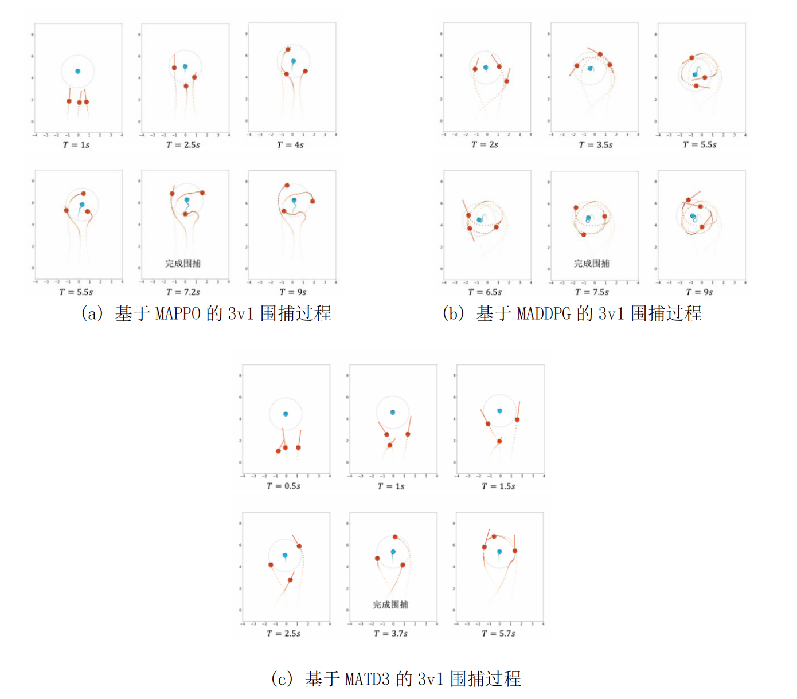

# Overview
## Multi-Agent Distributed Encirclement Control

This project is the 26th Student Innovation and Entrepreneurship Program of SJTU in 2023, which implements a multi-agent encirclement control algorithm using **Reinforcement Learning**. It combines simulation in Gazebo and real-world tests with omnidirectional robots via **ROS2**. 

